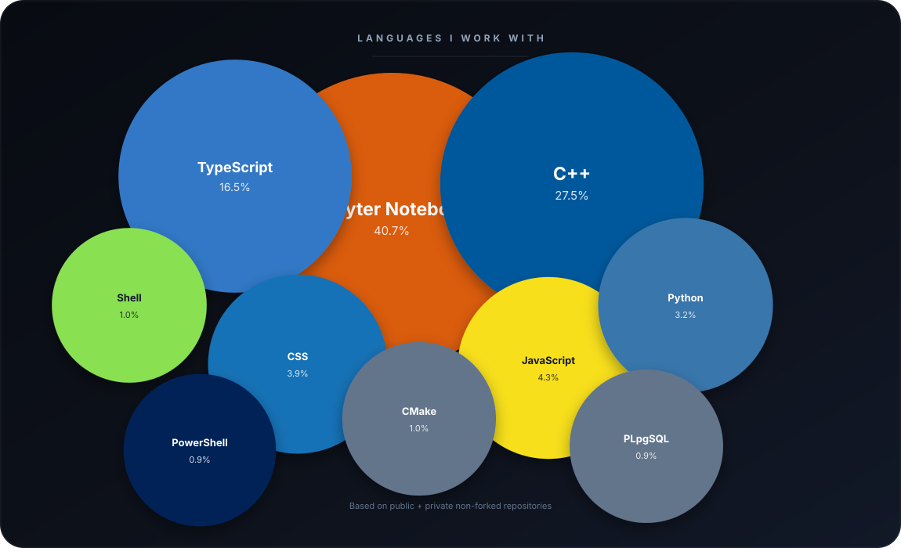

# Hamza Akbaş

### Information Systems Engineer · AI · Software · Data

**I build practical systems at the intersection of software engineering, artificial intelligence, and data.**

 

 

---

## About

I am an **Information Systems Engineer** focused on building software that solves real problems.

My interests sit around **Artificial Intelligence, Generative AI, Retrieval-Augmented Generation, Machine Learning, Data Science, and Software Engineering**. I enjoy taking an idea from exploration to a working system — from data and retrieval pipelines to user-facing applications.

I care about understanding the problem first, choosing the right architecture, and building solutions that are practical, maintainable, and useful.

---

## Selected Work

<table>
<tr>
<td width="50%" valign="top">

### ORES Chatbot

A source-grounded RAG assistant built around a product catalog and store policies. The system combines semantic retrieval, authenticated conversations, source attribution, and controlled responses.

**[Live Demo ↗](https://oreschatbot.vercel.app) · [Repository ↗](https://github.com/hmzakbss/oreschatbot)**

</td>
<td width="50%" valign="top">

### RAG Yazar Chatbot

A retrieval-augmented assistant designed for writers, combining semantic search with a conversational interface to work with a curated story knowledge base.

**[Repository ↗](https://github.com/hmzakbss/RAG-YAZAR-CHATBOT)**

</td>
</tr>

<tr>
<td width="50%" valign="top">

### Legal AI Research

An ongoing exploration into applying retrieval and OCR pipelines to legal decisions, with the goal of finding semantically similar precedents from large collections of documents.

**[Repository ↗](https://github.com/hmzakbss/private-legal)**

</td>
<td width="50%" valign="top">

### Breast Cancer CNN

A deep learning project exploring image classification with convolutional neural networks on histopathology imagery, including augmentation and model evaluation.

**[Repository ↗](https://github.com/hmzakbss/breast-cancer-cnn)**

</td>
</tr>
</table>

---

## What I Care About

|                                 |                                         |                                    |
| :-----------------------------: | :-------------------------------------: | :--------------------------------: |
|            **Build**            |                **Learn**                |             **Improve**            |
| Turn ideas into working systems | Explore new approaches through projects | Refine solutions through iteration |

 

I prefer learning by building: experimenting with an idea, understanding what works, identifying what does not, and improving the system until it becomes genuinely useful.

---

## Beyond the Code

* 🎓 Information Systems Engineering
* 🤖 Exploring practical AI and intelligent applications
* 📊 Interested in data-driven problem solving
* 🧠 Curious about retrieval, reasoning, and applied machine learning
* 🚀 Building projects that turn concepts into usable products

---

## Connect

If you are interested in **AI, software engineering, data, or building practical products**, feel free to reach out.

 

<a href="https://www.linkedin.com/in/hmzakbss/">LinkedIn</a>
  ·   <a href="https://www.kaggle.com/hamzaakbas">Kaggle</a>
  ·   <a href="mailto:hmzakbss@gmail.com">Email</a>

  

<i>Curious by nature. Building with purpose.</i>

